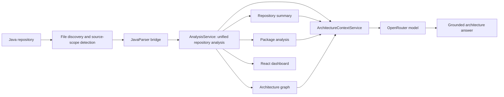

# CodeAtlas

**AI-powered Java architecture analyzer built with FastAPI, JavaParser, React, and OpenRouter.**

## Quick overview

Give CodeAtlas a public GitHub URL or a local Java project, and it creates an easy-to-explore overview of the codebase. It identifies classes, methods, packages, Spring controllers, API endpoints, repositories, and dependencies, then displays the results in a dashboard and an interactive architecture graph.

You can also ask questions about the analyzed project in plain language. Answers are based on the extracted architecture data rather than guesses or direct access to the source code. CodeAtlas currently focuses on Java and Spring projects and is intended for understanding structure, not running, editing, or reviewing the repository's code.

## Project structure

```text
CodeAtlas/
|-- backend/
|   |-- app/analyzers/       # Spring component, endpoint, and dependency extraction
|   |-- app/services/        # Analysis orchestration, derived views, and AI grounding
|   |-- app/api/routes/      # FastAPI endpoints
|   |-- java_parser/         # JavaParser bridge
|   `-- tests/               # Unit and API tests
`-- frontend/
    `-- src/
        |-- components/      # Dashboard, graph, and Architecture Assistant
        |-- services/        # Backend API client
        `-- utils/           # Graph transformation and layout
```

## What it demonstrates

- A multi-stage backend analysis pipeline for real Java repositories
- JavaParser integration through a small Java command-line bridge
- Detection of source scope, classes, methods, Spring components, endpoints, and dependencies
- Production/test summaries and package-level architecture analysis
- Interactive graph visualization with connectivity-aware layout and node details
- Stateless architecture Q&A grounded in deterministic structured metadata
- Clear LLM failure handling without embeddings, a vector database, or an agent framework

## Demo

Paste a public HTTPS GitHub repository URL or a local path and select **Analyze Repository**. CodeAtlas clones remote repositories into its workspace before running the same analysis pipeline. It then presents:

- repository and parser health metrics;
- production versus test source breakdown;
- packages, controllers, and repositories;
- a production dependency graph; and
- an AI Architecture Assistant for repository questions such as:
  - `What does OwnerController depend on?`
  - `Which repositories are used by controllers?`
  - `Explain the architecture of this repository.`

The configured OpenRouter model uses a free provider by default, so an occasional rate-limit response may require a retry.

The assistant keeps previous questions and answers visible for the current analysis. This transcript lives only in frontend memory: every request remains independently grounded, and the transcript clears when a new repository is analyzed or the page is refreshed.

## Architecture



The central design decision is **analyze once, derive many**. `POST /repositories/analyze-all` parses a repository once and derives the summary, package analysis, and graph from the completed analysis. The frontend retains that unified response and submits it with a question to `POST /repositories/ask`; asking a question does not parse the repository again.

### Why deterministic grounding instead of vector RAG?

CodeAtlas already produces structured architectural facts. Selecting relevant classes, endpoints, dependencies, packages, and graph relationships directly is simpler and more explainable than embedding the same data. The system prompt requires the model to distinguish observed facts from interpretation, admit when the metadata is insufficient, and never claim it read source code.

## Technology

| Area | Tools |
| --- | --- |
| Static analysis | Java, JavaParser, Maven |
| Backend | Python, FastAPI, Pydantic, httpx |
| Frontend | React, TypeScript, Vite |
| Visualization | React Flow (`@xyflow/react`) |
| AI | OpenRouter, deterministic structured context |
| Testing | pytest, FastAPI TestClient, mocked OpenRouter transport |

## Run locally

### Prerequisites

- Python 3.10+
- Node.js 18+
- JDK 8+
- Maven 3.6+
- An OpenRouter API key for the Architecture Assistant

### 1. Backend

From the repository root:

```powershell
cd backend
python -m venv .venv
.\.venv\Scripts\Activate.ps1
pip install -r requirements.txt
mvn -f java_parser/pom.xml package
Copy-Item .env.example .env
```

Set your key in `backend/.env`:

```dotenv
OPENROUTER_API_KEY=your_key_here
OPENROUTER_MODEL=openai/gpt-oss-20b:free
```

Never commit `backend/.env`; it is already Git-ignored.

Start FastAPI from `backend`:

```powershell
uvicorn main:app --reload
```

API documentation is available at `http://localhost:8000/docs`, and health status at `http://localhost:8000/health`.

### 2. Frontend

In another terminal:

```powershell
cd frontend
npm install
Copy-Item .env.example .env
npm run dev
```

Open `http://localhost:5173` and enter either:

- a public URL such as `https://github.com/spring-projects/spring-petclinic`; or
- an absolute Java repository path readable by the backend.

## Primary API flow

For a GitHub URL, the frontend first calls `POST /repositories/clone` and passes the returned `local_path` into the analysis request below. Local paths skip the cloning step.

### Analyze once

```http
POST /repositories/analyze-all
Content-Type: application/json

{
  "local_path": "C:\\path\\to\\java-repository"
}
```

The response contains `analysis`, `summary`, `packages`, and `graph`.

### Ask from existing analysis

```http
POST /repositories/ask
Content-Type: application/json

{
  "question": "What does OwnerController depend on?",
  "context": { "analysis": {}, "summary": {}, "packages": {}, "graph": {} }
}
```

The real request uses the complete `/repositories/analyze-all` response as `context`. The API key stays on the server, and CodeAtlas sends selected metadata, not repository source files, to OpenRouter.

Other endpoints expose cloning, inspection, raw analysis, graph, summary, package, method, and controller views. See the generated FastAPI documentation for their schemas.

## Validation

Run backend tests from `backend`:

```powershell
pytest -q
```

Build the frontend from `frontend`:

```powershell
npm run build
```

The Phase 1 reference repository was Spring PetClinic. Its verified analysis produced 49 Java files with no parse failures, 49 classes, 6 controllers, 3 repositories, 17 endpoints, 67 declared dependencies, and a 25-node/7-edge production graph.

## Scope and limitations

- Java and Spring-focused; it is not a general multi-language analyzer.
- Dependency extraction models declared structural relationships, not a full runtime call graph.
- Public HTTPS GitHub repositories are supported; private repositories and authenticated cloning are out of scope.
- AI Q&A is stateless and may only answer from supplied CodeAtlas metadata.
- No authentication, persistence, vector database, code generation, or source modification is included.
